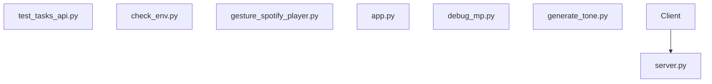

# 🖐️ PalmPlay: Magic Music Hands

**Control your music with the wave of a hand!**

PalmPlay turns your webcam into a touch-free media controller. Whether you're using the modern web interface or the classic desktop app, you can control Spotify or local music files with simple hand gestures.

---

## ✨ Features

- **Gesture Control**: Play/Pause, Next/Prev Track, and Volume Control using hand signs.
- **Modern Web Interface**: beautiful Dark Theme UI with Glassmorphism, built with Streamlit.
- **Classic Desktop Mode**: Lightweight windowed application for quick control.
- **Spotify Integration**: Seamlessly control your Spotify playback.
- **Local Music Support**: Play files directly from your local folders.
- **Visual Feedback**: Real-time gesture tracking and smooth animations.

---

## 🚀 Quick Start

### 1. Install Dependencies
```bash
pip install -r requirements.txt
```

### 2. Choose Your Interface

#### 🌟 Option A: Modern Web App (Recommended)
Launch the beautiful, feature-rich web interface:
```bash
streamlit run app.py
```
*Opens in your browser at `http://localhost:8501`*

#### 🖥️ Option B: Classic Desktop App
Run the lightweight CV window:
```bash
python gesture_spotify_player.py
```

---

## 👋 Magic Gestures

The player uses intuitive gestures to control your playback:

| Action | Gesture | Description |
| :--- | :--- | :--- |
| **Play / Pause** | ✊ **Fist** | Clench your hand to toggle playback. |
| **Next Track** | 🖐️ **Swipe Right** | Move your open palm rapidly to the right. |
| **Prev Track** | 🖐️ **Swipe Left** | Move your open palm rapidly to the left. |
| **Volume Control** | ✌️ **Two Fingers** | Hold a "Peace" sign and move your hand **Up** or **Down**. |

---

## 🛠️ Configuration

### Spotify Setup (Optional)
To control Spotify, set these environment variables (create a `.env` file):
```env
SPOTIPY_CLIENT_ID='your_client_id'
SPOTIPY_CLIENT_SECRET='your_client_secret'
SPOTIPY_REDIRECT_URI='http://localhost:8888/callback'
```

### Local Music
Place your `.mp3`, `.wav`, or `.ogg` files in the `local_music/` folder. The app will automatically detect them.

---

## 📜 Project Structure

- **`app.py`**: The modern Streamlit web application.
- **`gesture_spotify_player.py`**: The core gesture recognition logic and desktop app.
- **`server.py`**: FastAPI backend for advanced serving capabilities.
- **`static/`**: Assets for the web interface.
- **`local_music/`**: Directory for local audio files.

---

*Created with ❤️ for intuitive music control.*


<!-- AUTO-GENERATED-DOCS-START -->
# 🤖 Automated Repository Overview

*This README is automatically generated and updated by AI and CI/CD pipelines.*

## 📊 System Architecture

### Static View



### Interactive View

An interactive, clickable node diagram has been generated. [View Interactive Diagram](./diagrams/interactive_architecture.html)

## 🛠️ Technology Stack

- Python ecosystem


## ⚙️ Environment Variables

| Variable | Description |
| -------- | ----------- |
| `SPOTIPY_CLIENT_ID` | Configured externally |
| `SPOTIPY_CLIENT_SECRET` | Configured externally |
| `SPOTIPY_REDIRECT_URI` | Configured externally |


## 🚀 Quick Start

1. **Install dependencies:**
   ```bash
   pip install -r requirements.txt
   ```

2. **Set up environment:**
   Copy `.env.example` or `.env.bak` to `.env` and configure.

3. **Run the application:**
   ```bash
   python app.py  # or streamlit run app.py depending on your framework
   ```

<!-- AUTO-GENERATED-DOCS-END -->
